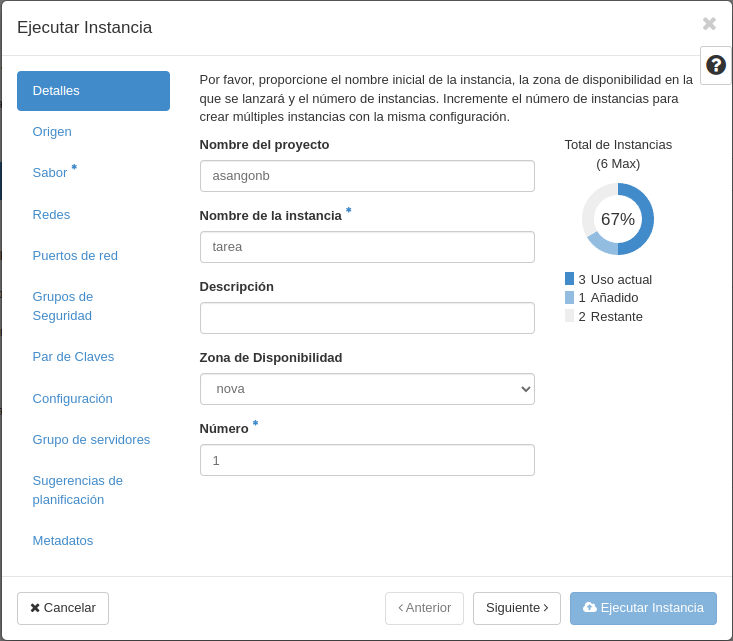
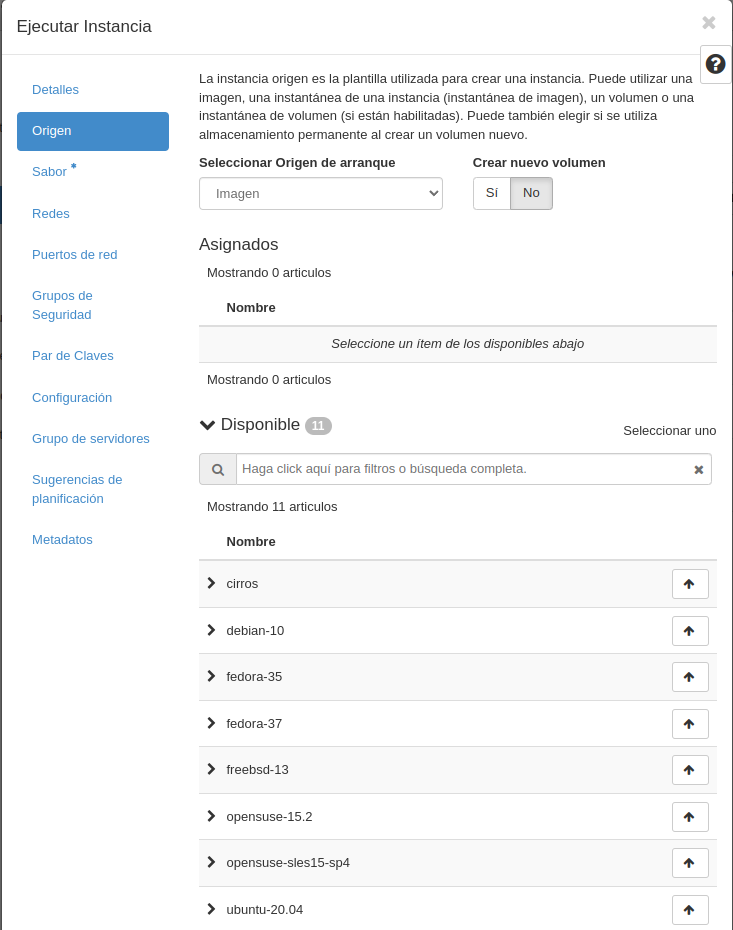
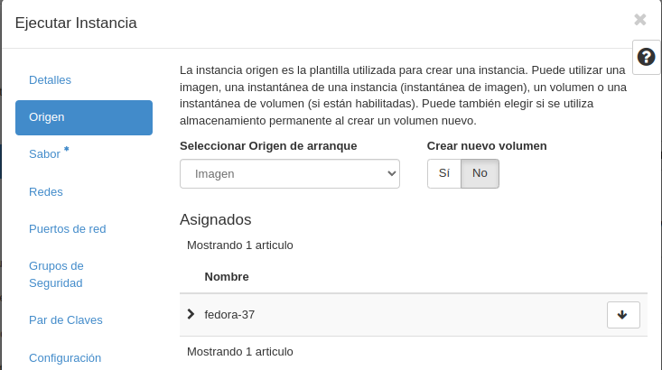
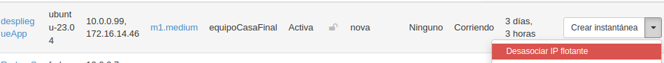

# Pasos a seguir para montar un servidor con Fedora

### El primer paso a seguir es la creación de un servidor. En nuestro caso estamos usando openstack cedido por el I.E.S Celia Viñas.

1. Acceder con nuestro usuario y contraseña. Nos vamos al apartado de __INSTANCIAS__ que esta en el margen derecho.
2. Seleccionamos __LANZAR INSTANCIA__.
3. Se nos abrirá esta ventana. 
4. Será esencial únicamente en la primera ventana seleccionar un nombre.
5. La siguiente pestaña que nos saldrá será la de __origen__. 
6. Aquí elegiremos crear una __imagen__, y aqui seleccionaremos el sistema operativo en el que queremos basar nuestro servidor. En este caso hemos seleccionado Fedora    
7. El siguiente paso es seleccionar el __"sabor"__ que es la cantidad de __memoria ram__ y de __disco duro__ que queremos utilizar.
8. Entre el paso anterior y el siguiente hay algunos pasos que podemos saltar y editar más tarde, como los puertos, las redes y los grupos de seguridad.
9. __El par de claves__ es un paso muy importante, que te permite conectarte a esa imagen que estas creando. Es importante no perderla. ya que mediante ```ssh -i {enlace de la clave} nombreImagen@ipFlotanteAsignada``` es como nos conectamos.
10. Confirmamos y ya tendriamos nuestro servidor creado.
11. El paso final sería asociarte una __IP Flotante__, que se crea de forma sencilla aquí  donde a mi me sale, __Desasociar IP__, debe salir __Asociar IP Flotante__ si no tienes una asociada.

### Ejecución y explicación de comandos.

#### Servidor apache.

En el archivo [install_lamp.sh](./script/install_lamp.sh) tenemos todo lo necesario para la creación de un servidor con apache, actualizamos Fedora, instalamos httpd, MySQL y PHP y reiniciamos el servidor.

#### Despliegue de aplicación

Tenemos un archivo oculto dentro de la carpeta script llamado __.env__ donde tenemos una serie de variables que vamos a utilizar más adelante.

Lo primero que tenemos que hacer es importar ese archivo con el comando ```source .env```

Borramos las instalaciones previas para que no de fallo y clonamos el repositorio (en este caso),  y movemos el codigo desde la carpeta contenedora a la carpeta __/var/www/html__.

Ahora vamos a configurar el archivo config.php donde tenemos las conexiones a B.B.D.D. 

Ahora importamos el script SQL para crear la tabla

Creamos el usuario y le damos los privilegios para poder trabajar ocn las tablas, en este caso le damos todos los permisos para todas las tablas

El último paso es cambiar el contexto (ya que fedora usa una seguridad _"mejorada"_ y tiene un paso de seguridad extra con respecto a Ubuntu).

